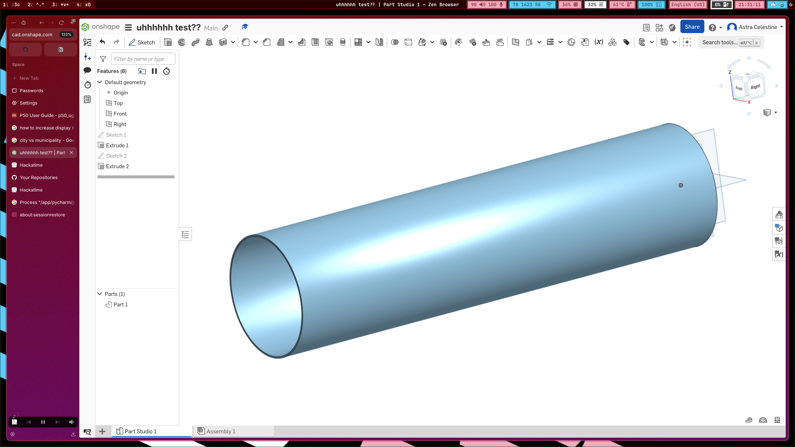
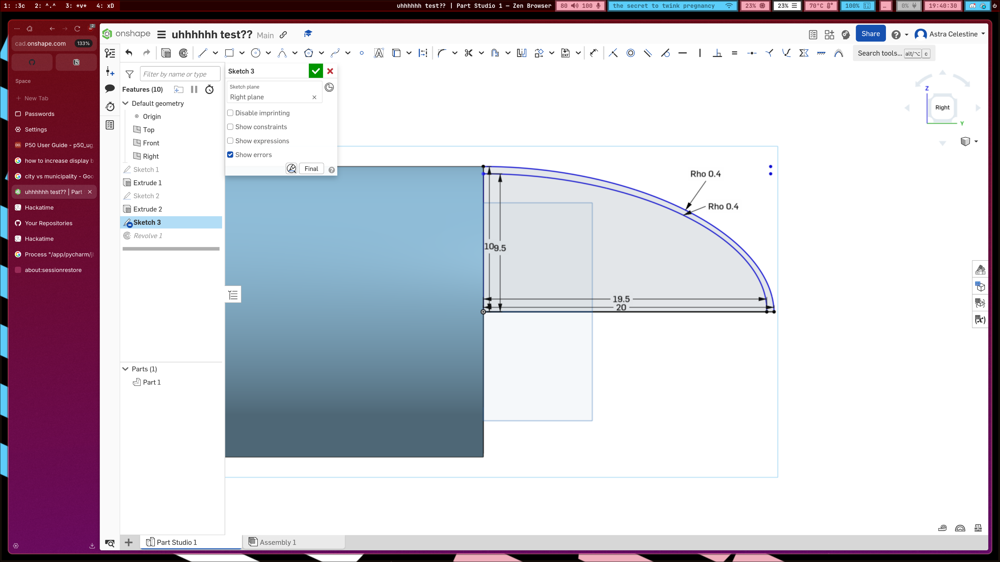
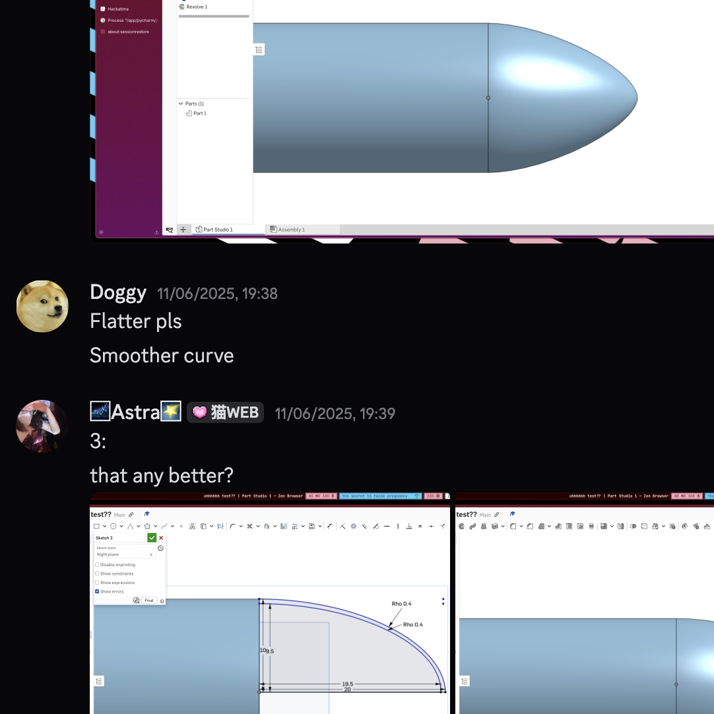
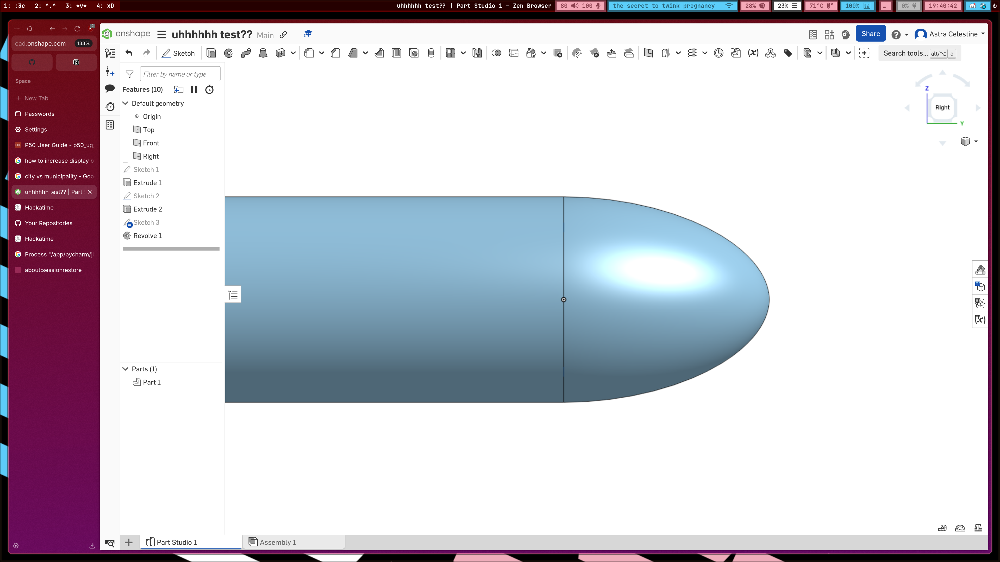
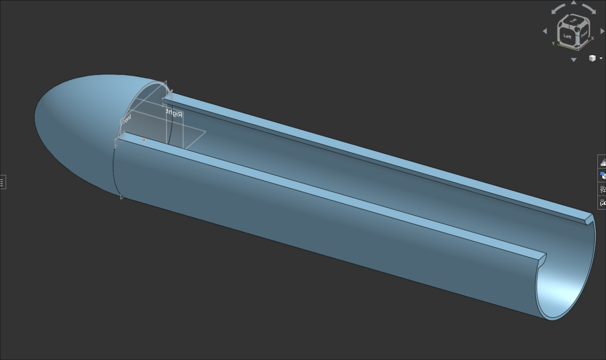
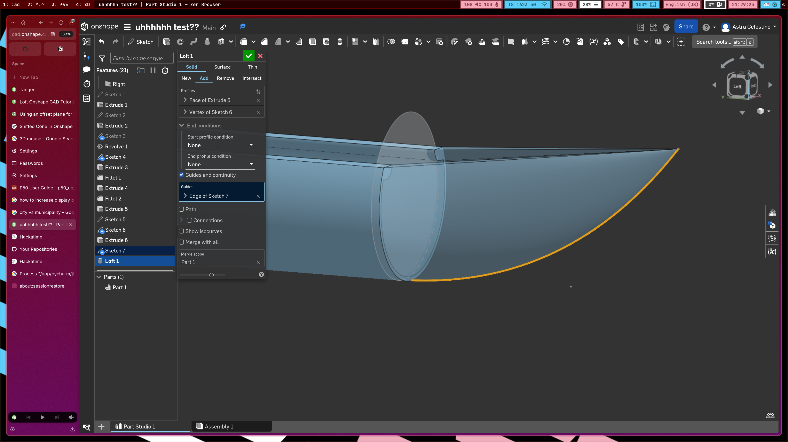
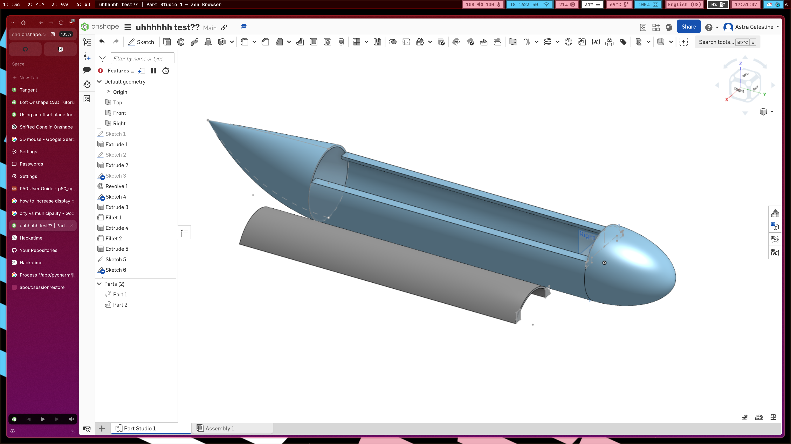
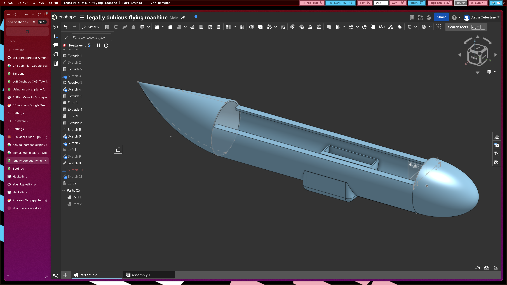

# Journal :D

## please log whatever you did / are doing, including mistakes here
## https://highway.hackclub.com/advanced/example-journal

## May 8th 2025 - Logger: Ghost
I recieved my 2nd LoRa module and can finally do some testing. I messed around with the LoRa library for aruduino made by Sandeep Mistry.
I tested the Lora module without the antennas and I didn't know that it was a big mistake as it could destroy the radio module and I also found out my LoRa modules are not communicating properly (as long as they are designed for) so i might have fried them.

## May 24th 2025 - Logger: Astra
Today, me and Ghost met up to test the LoRa module I bought the other week since she's unsure if hers works :P
Turns out, both of her LoRa modules got fried (RIP),,, so uh that's great... but at least the "Lo"Ra modules do still work short-range (like a few cm apart) so we can still test that
Outside of that, we also tested the accelerometer / gyro module, and seems to work? i don't understand the readings tho :sob: it's confusing...
We decided to just stop buying new components for now, and work with what we have first, focussing on creating CAD and PCB models first to get the stippends as the entire group is like,,, really broke...

[LoRa video](https://hc-cdn.hel1.your-objectstorage.com/s/v3/142abf9ee1947f46ea742f3a9a95a17131fc7f63_img_3928.mp4)

[gyro testing video](https://hc-cdn.hel1.your-objectstorage.com/s/v3/621003c66919163e77c02e429bbf76a9c26b7368_img_3929.mp4)

## June 6th 2025 - Logger: Astra
Summer finally started + exams are over, so we can finally actually actually start working on this thing... now how the f^^k do i use freecad...

## June 9th 2025 - Logger: Astra
I've been spending the past while trying to figure out how to use FreeCAD to no avail, genuinely cannot figure it out. to be fair, I couldn't figure out how to use the other CAD softwares too, but at least i got a bit further with Onshape so I think I'll be using that :P
Really excited for what's to come :3c

## June 19th 2025 - Logger: Astra
For the past 2 weeks or so I've been tryna figure out CAD modelling. Gave up on using FreeCAD and ended up using Onshape instead. Overall, things seem pretty great :D 
Modelled most of the body and fuselage now, and we'll meet up tomorrow to discuss the wings' measurements so I can model it :D

It took quite a while for me to figure out how to use Onshape, especially figuring out how to use new tools such as the loft tool (which i used for the back of the plane). But now that I figured it out, it's gonna be so much more convenient for future stuff!!!

The first time making something, started with a hollowed out cylinder. We agreed to have the walls be around 5mm thick

Designing nosecone - got feedback from groupmates and ended up changing some things a bit 

Using the loft tool for the first time to design the tail / back / whatever it's called of the plane. It was quite confusing at first, took me a lot of time to troubleshoot, but at the end of the day, i got it working!!!

Oh and i also forgot to mention, i made it so that the top of the fuselage is removable so it's easy for us to make modifications inside the plane later on without completely disassembling the thing
Here's how the final thing ended up looking

Oh and also added a little holder / base thing for the wing as well

Gonna be meeting with group tmr so we can discuss wings (i think i alr mentinoed this above but cant find it :P)

## June 20th 2025 - Logger: Astra
Met up with group today!!! generally pretty okay, although less productive than originally planned, we still got all of the planned work done! smh had to bribe the physics nerd to come only for him to slack off the entire time (tbf, his interest is in electrical engineering not aero/fluid-dynamics) :3c
we did a lot of calculations on the estimated weight of the plane once we bought everything (the batteries are SO heavy omg) and it seems pretty likely it'll be able to fly! although we will need a few battery packs (like 4 to 6) for it to fly for any extended period of time though- :(
here are some photos of our meetup!!!

here's some of the stuff that we ended up with :D

also added holes to the thing too, i'll design the 2 wings later :3c

took a bit to figure out because it has to be rotated 3º horizontally and 30º vertically :P

## July 1st 2025 - Logger: Ghost
I started to learn how to do pcb, it was quite challanging espescially with all the footprints and I still need to find where all of the components are since im just starting

## July 7th 2024 - Logger: Ghost
I sorta finised the schematic and now I only need to add all the correct footprints and make a board design. The board consists of an Arduino Nano, a pca 9685 pwm LED controller for the servos and 2 motors, 1 buck boost converter for stability and an ams1117 for the LORA modules.
